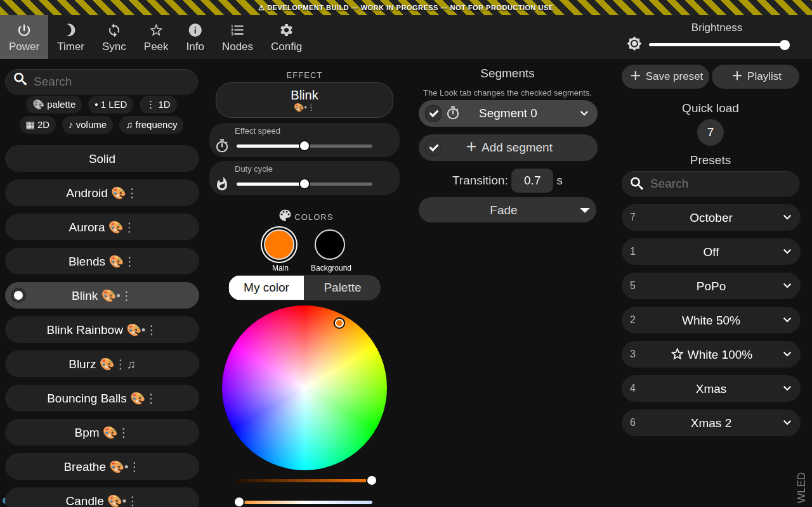
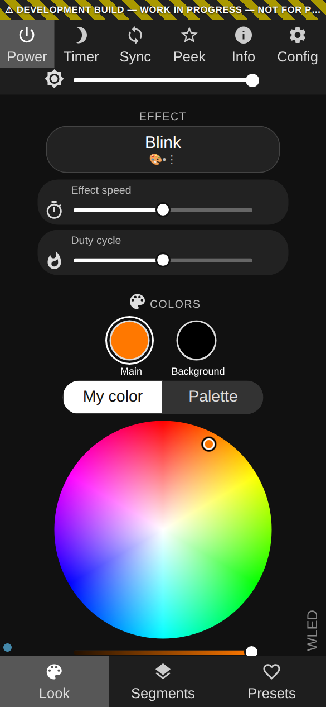
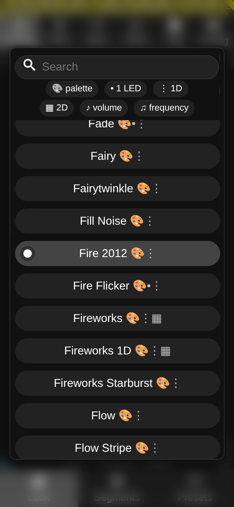
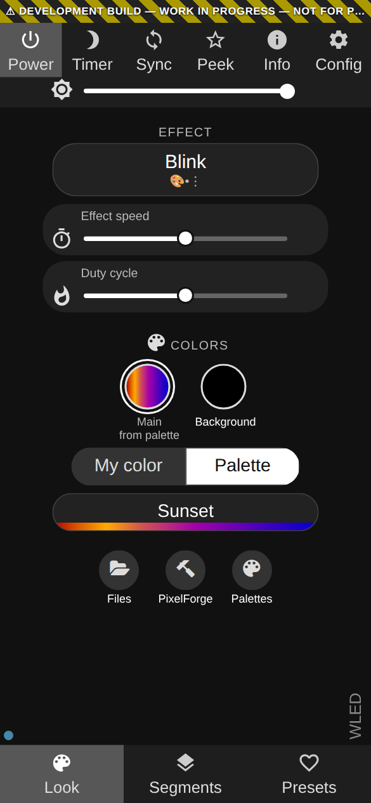
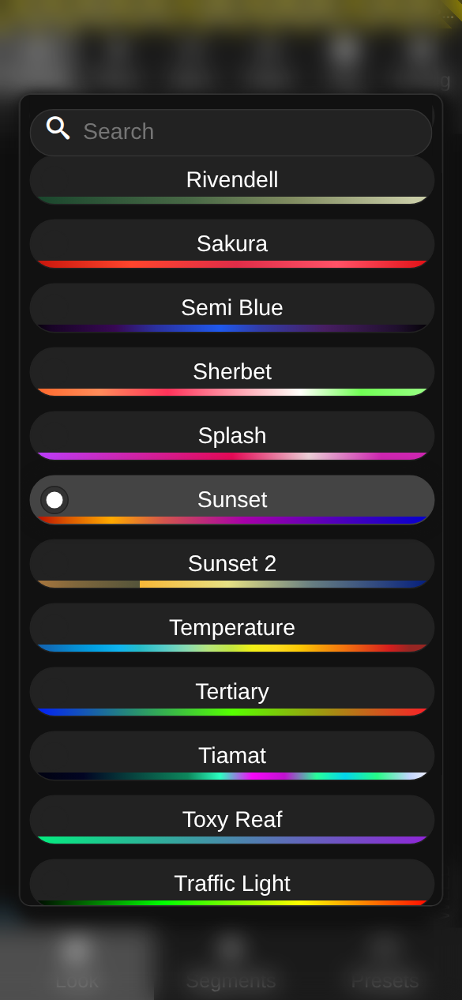
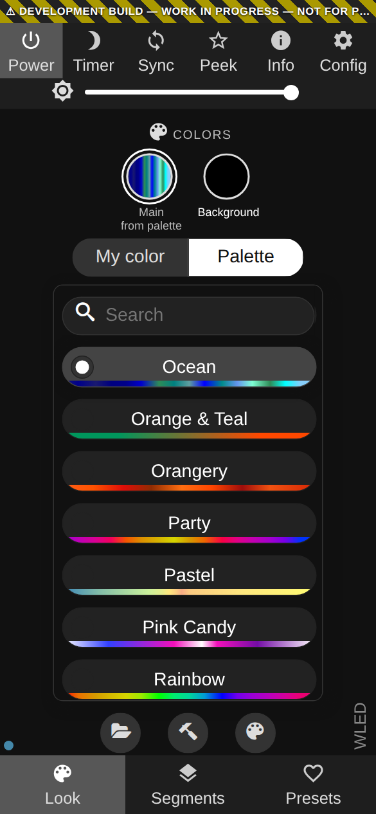
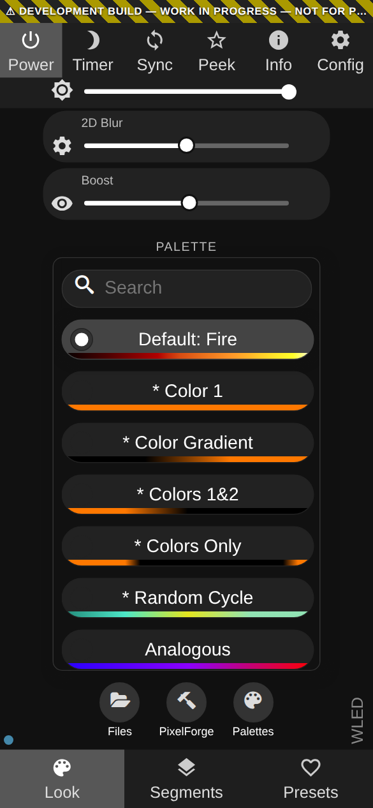

# The redesigned web UI: user guide

Screenshots: QuinLED Dig-Uno v3 (ESP32) running the betas of 2026-10-05.

How the redesigned main page works. Applies to both variants; where they differ, A is the palette button with a popup list
(`ui-redesign`) and B is the palette card (`ui-redesign-palette-card`).

## Tabs and layout

- Three tabs: **Look**, **Segments**, **Presets**. Look replaces the old Colors and Effects tabs; old `#Colors` / `#Effects` links open Look.
- Screens 1024 px and wider show four columns side by side (effect list | Look | Segments | Presets) and no tab bar.
- **Config > User Interface > "Enable simplified UI"** now means: always use the single-column layout, also on wide screens. It no longer
  hides controls (see "Changes from upstream" below).
- The PC Mode button is gone; the layout follows the screen width.

## Look tab, from top to bottom

### Which segments change

A chip at the top names the segments the Look tab changes ("Changing: Segment 0"). They are the segments checked on the Segments tab.
When no segment is checked, the chip turns red and says that changes do nothing.

### Effect

The effect button shows the current effect and its feature icons. It opens the effect list with a search field and filter chips.
The chips double as the legend for the icons in the list:

| Chip | Icon in the list | Meaning |
|---|---|---|
| palette | 🎨 | the effect uses the palette |
| 1 LED | • | works on a single LED |
| 1D | ⋮ | runs on a strip |
| 2D | ▦ | runs on a matrix |
| volume | ♪ | reacts to sound volume (audio reactive) |
| frequency | ♫ | reacts to sound frequencies (audio reactive) |

Checked chips filter the list to effects that have all checked features. Without a 2D matrix, effects that only run in 2D are not
listed; the 2D chip then shows the effects that run in both 1D and 2D.

### Sliders and options

Only the sliders and checkboxes the effect uses are shown, with the effect's own names as visible labels (before, the names were only
tooltips).

### Colors

Only the colors the effect uses are shown, named "Main", "Background", "Accent" or with the effect's own label (instead of Fx/Bg/Cs).
Some effects use a color only with certain settings; the color appears while it is used:

- Colorful: its three colors above 160 on "Pastel / Classic / My colors" (and with the Default palette).
- Black Hole: the main color with "Solid".
- Bouncing Balls, Rolling Balls, Popcorn: all three colors when color 3 is not black, otherwise only the main color.

### My color / Palette switch

A color that the effect draws through the palette gets a switch below the color circles:

- **My color** selects the Default palette and shows the color picker.
- **Palette** hides the color picker and uses the last palette you chose. The first time, it selects Party.
  - A: the palette is shown as a button; it opens the palette list as a popup, which closes after you pick a palette.
    The first time, the popup opens by itself.
  - B: the palette list is shown as a card where the color picker was, and it stays there after you pick a palette.
    It scrolls to the current palette when it appears or when the palette is changed elsewhere (preset, another app).
- The color circle then shows the palette, with "from palette" under its name.

| A: palette button | A: popup list | B: palette card |
|---|---|---|
|  |  |  |

There is no switch on colors that a palette never replaces (for example the background of many effects).
Effects that only use the palette (Fire 2012, Rainbow, ...) show only the palette (A: button, B: card).

The palette is a setting of the segment, so the switch changes it for all colors of the effect that come from the palette.

### "\* Color" palettes

The palettes "\* Color 1", "\* Colors 1&2", "\* Color Gradient" and "\* Colors Only" are made from your colors, so the color picker
stays visible with them, also for colors the effect would otherwise hide. This includes "Default" when it is the effect's own
"\* Color" palette (Railway: "\* Colors 1&2", Slow Transition: "\* Color 1").

### What "Default" means

"Default" is not one palette: each effect decides what it shows with Default. Once the device has run the effect with Default, the
Default entry is named for that effect:

- "Default: Fire" (the effect's own palette, with its preview),
- "Default: my colors" (the effect draws your colors),
- both ("Default: Rainbow + my colors"),
- "Default: built-in colors" (for example a rainbow that is not a palette).

Until the device has run the effect with Default, the entry reads just "Default".

### White channel and white balance

On strips with a white channel or adjustable white (RGBW, CCT), the white channel slider and the white balance slider stay visible
when the color picker is hidden (effects without colors, or a color that comes from the palette). The white channel is not replaced by
the palette. For effects without colors, the white slider sets the white of color 1, which those effects use.

### Palette list

Every palette shows a preview gradient. A newly selected palette is scrolled into view.

## Switching effects keeps your palette

With "Use effect default parameters" on (Config > User Interface, on by default), switching effects keeps the palette you selected, also when the effect has
a default palette of its own. Other apps (Home Assistant, the WLED app) still switch to the effect's own palette.

## Presets tab

"Save preset" and "Playlist" are at the top of the list (before, at the bottom). They scroll with the list.

## Changes from upstream that users may notice

- "Enable simplified UI" no longer hides the tab bar, top-bar buttons, segment details, effect filters and the Effects/Segments/Presets
  tabs. A device set up with it for simple use (a kiosk, a family member) shows the full UI.
- The PC Mode button and the "Show bottom tab bar in PC mode" setting are removed; the layout is chosen per device (Simplified UI), not
  per browser.
- Switching effects keeps your palette (see above).
- Waverly: "Blur" is on checkbox 3, the one the effect has always read. Presets are unaffected.
- Controls an effect never reads are hidden (for example the palette for Two Dots, Drip, TV Simulator, PacMan; "Fade rate" for Ripple
  Peak; an unused checkbox for Octopus).
- Colorful: the "Saturation" slider is named "Pastel / Classic / My colors", which is what it selects.
